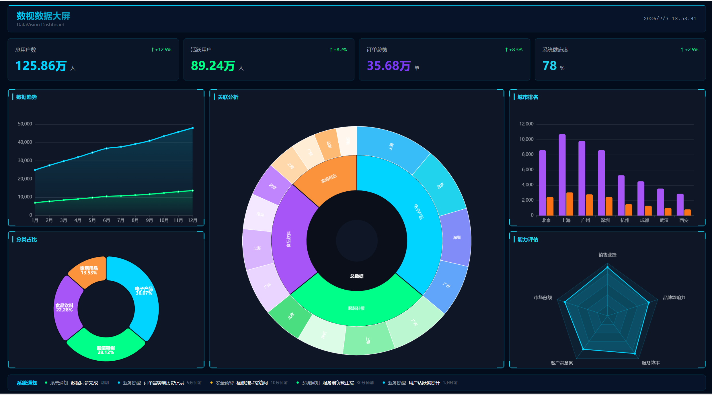

# DataVision - 数视数据大屏

一个现代化的数据可视化大屏项目，采用 Vue 3 + TypeScript + ECharts 技术栈构建，提供丰富的图表展示和交互体验。

## ✨ 特性

- 🎨 **精美的深色主题**：采用深蓝色背景配合青色高亮，打造专业的数据大屏视觉效果
- 📊 **多种图表组件**：支持折线图、柱状图、饼图、雷达图、旭日图、仪表盘、地图等多种数据可视化方式
- 📱 **响应式布局**：自适应屏幕尺寸，支持大屏展示，基于设计稿尺寸进行缩放居中
- 🔄 **数据适配器模式**：支持 Mock 数据和真实 API 无缝切换，通过环境变量配置
- 🧪 **完善的测试体系**：使用 Vitest 进行单元测试，支持覆盖率报告生成
- ✅ **代码质量保障**：集成 ESLint、Prettier、Stylelint 进行代码检查和格式化
- 📝 **日志系统**：支持多级别日志输出，可通过环境变量配置日志级别
- ⚡ **高性能渲染**：使用 Canvas 渲染器，支持图表自适应和渐进式加载动画

## 🛠️ 技术栈

| 技术 | 版本 | 说明 |
|------|------|------|
| Vue | 3.5.x | 前端框架，使用 Composition API |
| TypeScript | 5.8.x | 类型安全，增强代码可维护性 |
| ECharts | 5.6.x | 数据可视化图表库 |
| vue-echarts | 6.6.x | ECharts Vue 组件封装 |
| Pinia | 2.2.x | 状态管理，替代 Vuex |
| Vite | 7.3.x | 构建工具，快速冷启动 |
| Sass | 1.87.x | CSS 预处理器，支持变量和嵌套 |
| Vitest | 3.2.x | 单元测试框架，兼容 Vite |
| axios | 1.7.x | HTTP 客户端 |
| dayjs | 1.11.x | 日期处理库 |
| lodash-es | 4.17.x | 工具函数库 |

## 📁 项目结构

```
DataVision/
├── src/                           # 源码目录
│   ├── components/                # 组件目录
│   │   ├── charts/                # 图表组件（核心）
│   │   │   ├── BarChart.vue       # 柱状图 - 城市销售排名
│   │   │   ├── LineChart.vue      # 折线图 - 销售趋势
│   │   │   ├── PieChart.vue       # 饼图(环形图) - 分类占比
│   │   │   ├── RadarChart.vue     # 雷达图 - 综合评估
│   │   │   ├── GraphChart.vue     # 旭日图 - 关联分析（渐进式动画）
│   │   │   ├── GaugeChart.vue     # 仪表盘 - 关键指标
│   │   │   └── MapChart.vue       # 地图 - 区域分布
│   │   ├── widgets/               # 通用组件
│   │   │   ├── StatCard.vue       # 统计卡片 - 顶部数据展示
│   │   │   └── BorderDecor.vue    # 边框装饰 - 发光边框效果
│   │   └── ScreenContainer.vue    # 大屏容器 - 缩放居中处理
│   ├── views/                     # 页面视图
│   │   └── Dashboard.vue          # 数据大屏主页面（三栏布局）
│   ├── stores/                    # Pinia 状态管理
│   │   └── dashboard.ts           # 仪表盘数据状态管理
│   ├── services/                  # 数据服务层
│   │   ├── adapters/              # 数据适配器（核心设计模式）
│   │   │   └── dataAdapter.ts     # MockAdapter / ApiAdapter 切换
│   │   └── mock/                  # Mock 数据
│   │       └── dashboard.ts       # 模拟数据生成
│   ├── utils/                     # 工具函数
│   │   └── logger.ts              # 日志工具（单例模式）
│   ├── styles/                    # 样式文件
│   │   ├── global.scss            # 全局样式（重置、通用类）
│   │   └── theme.scss             # 主题变量（颜色、间距）
│   ├── types/                     # 类型定义
│   │   └── index.ts               # TypeScript 接口定义
│   ├── tests/                     # 测试文件
│   │   ├── services/
│   │   │   └── mock.test.ts       # Mock 数据测试
│   │   └── utils/
│   │       └── logger.test.ts     # 日志工具测试
│   ├── App.vue                    # 根组件
│   ├── main.ts                    # 入口文件（ECharts 组件注册）
│   └── env.d.ts                   # 环境类型声明
├── .env                           # 环境变量配置
├── .eslintrc.cjs                  # ESLint 配置
├── .prettierrc                    # Prettier 配置
├── .stylelintrc.cjs               # Stylelint 配置
├── tsconfig.json                  # TypeScript 配置
├── vite.config.ts                 # Vite 配置
├── vitest.config.ts               # Vitest 配置
└── package.json                   # 项目依赖和脚本
```

## 🚀 快速开始

### 环境要求

- Node.js >= 18.0.0
- npm >= 9.0.0

### 安装依赖

```bash
npm install
```

### 启动开发服务器

```bash
npm run dev
```

访问 http://localhost:5173/ 查看效果

### 效果截图


### 构建生产版本

```bash
npm run build
```

构建产物输出到 `dist/` 目录

### 预览生产版本

```bash
npm run preview
```

## 📋 可用脚本

| 脚本 | 命令 | 说明 |
|------|------|------|
| 开发 | `npm run dev` | 启动开发服务器，端口 5173 |
| 构建 | `npm run build` | 构建生产版本，输出到 dist |
| 预览 | `npm run preview` | 预览生产构建结果 |
| 测试 | `npm run test` | 运行单元测试 |
| 测试覆盖率 | `npm run test:coverage` | 运行测试并生成覆盖率报告 |
| Lint | `npm run lint` | 运行 ESLint 检查并修复 |
| 格式化 | `npm run format` | 运行 Prettier 格式化代码 |
| 样式检查 | `npm run lint:style` | 运行 Stylelint 检查 |

## 📊 图表组件详细说明

### BarChart - 柱状图

**文件**：`src/components/charts/BarChart.vue`

**功能**：展示城市销售排名数据

**特性**：
- 渐变色柱状图（青色到蓝色渐变）
- 悬浮高亮效果
- 数值标签显示
- 支持自动排序

**数据结构**：
```typescript
interface BarChartData {
  labels: string[]      // 城市名称
  series: {
    name: string        // 系列名称
    data: number[]      // 销售数据
    color?: string      // 颜色
  }[]
}
```

### LineChart - 折线图

**文件**：`src/components/charts/LineChart.vue`

**功能**：展示销售趋势数据

**特性**：
- 平滑曲线
- 区域渐变填充
- 悬浮提示显示详细数据
- 支持多系列对比

### PieChart - 饼图(环形图)

**文件**：`src/components/charts/PieChart.vue`

**功能**：展示分类占比数据

**特性**：
- 环形设计（空心饼图）
- 标签显示在扇区内部（名称 + 百分比）
- 悬浮高亮效果
- 图例展示

**数据结构**：
```typescript
interface PieDataItem {
  name: string                // 分类名称
  value: number               // 数值
  itemStyle?: { color: string } // 自定义颜色
}
```

### RadarChart - 雷达图

**文件**：`src/components/charts/RadarChart.vue`

**功能**：展示多维评估数据

**特性**：
- 六维度评估（系统性能、数据安全、用户体验、运营效率、服务质量、创新能力）
- 多边形填充效果
- 悬浮提示显示详细指标

### GraphChart - 旭日图

**文件**：`src/components/charts/GraphChart.vue`

**功能**：展示数据关联分析

**特性**：
- **渐进式加载动画**：从中心「总数据」节点开始，依次展开分类层和城市层
- 三层数据结构（总数据 → 产品分类 → 城市）
- 悬浮提示显示完整路径和占比
- 高亮交互效果

**动画流程**：
1. 显示中心节点（总数据）
2. 300ms 后展开第二层（电子产品、服装鞋帽、食品饮料、家居用品）
3. 600ms 后展开第三层（北京、上海、广州、深圳）

### GaugeChart - 仪表盘

**文件**：`src/components/charts/GaugeChart.vue`

**功能**：展示关键指标进度

**特性**：
- 半圆环设计
- 动画进度展示
- 数值标签显示

### MapChart - 地图

**文件**：`src/components/charts/MapChart.vue`

**功能**：展示全国区域数据分布

**特性**：
- 中国地图展示
- 热力图效果
- 悬浮提示显示区域数据

## 🏗️ 架构设计

### 数据适配器模式

项目采用适配器模式实现 Mock 数据与真实 API 的无缝切换：

**核心接口**（`src/services/adapters/dataAdapter.ts`）：
```typescript
export interface DataAdapter {
  getDashboardData(): Promise<DashboardData>
  getLineChartData(): Promise<LineChartData>
  getBarChartData(): Promise<BarChartData>
  getPieChartData(): Promise<PieChartData>
  getMapChartData(): Promise<MapChartData>
  getGaugeData(): Promise<GaugeData>
  getRadarChartData(): Promise<RadarChartData>
  getRealtimeData(): Promise<RealTimeData>
}
```

**实现类**：
- `MockAdapter`：开发阶段使用，返回本地模拟数据
- `ApiAdapter`：生产环境使用，调用真实后端 API

**切换方式**：通过环境变量 `VITE_DATA_SOURCE` 配置
- `VITE_DATA_SOURCE=mock`：使用 Mock 数据（默认）
- `VITE_DATA_SOURCE=api`：使用真实 API

### 状态管理

使用 Pinia 进行集中状态管理：

**Store**（`src/stores/dashboard.ts`）：
- 管理所有图表数据
- 提供统一的数据加载方法
- 支持响应式更新

### 日志系统

使用单例模式实现日志工具（`src/utils/logger.ts`）：

**日志级别**：
- `DEBUG`：调试信息
- `INFO`：一般信息（默认）
- `WARN`：警告信息
- `ERROR`：错误信息

**配置方式**：通过环境变量 `VITE_LOG_LEVEL` 配置

## 🎨 主题配置

### 颜色变量（`src/styles/theme.scss`）

| 变量 | 值 | 说明 |
|------|-----|------|
| `$bg-primary` | `#030c1a` | 主背景色（深蓝） |
| `$bg-secondary` | `#0a1628` | 次要背景色 |
| `$bg-card` | `rgba(10, 22, 40, 0.8)` | 卡片背景色 |
| `$accent-cyan` | `#22d3ee` | 青色高亮 |
| `$accent-green` | `#00ff88` | 绿色高亮 |
| `$accent-purple` | `#a855f7` | 紫色高亮 |
| `$accent-orange` | `#fb923c` | 橙色高亮 |
| `$text-primary` | `#ffffff` | 主文字颜色 |
| `$text-secondary` | `rgba(255, 255, 255, 0.7)` | 次要文字颜色 |
| `$border-color` | `rgba(0, 212, 255, 0.3)` | 边框颜色 |

### 大屏容器（`src/components/ScreenContainer.vue`）

- 设计尺寸：1920x1080
- 缩放策略：保持宽高比，居中显示
- 适配方式：基于屏幕尺寸动态计算缩放比例

## ⚙️ 环境配置

### `.env` 文件

```env
# 数据来源: mock | api
VITE_DATA_SOURCE=mock

# 日志级别: DEBUG | INFO | WARN | ERROR
VITE_LOG_LEVEL=INFO

# API 基础地址（当使用 api 数据源时）
VITE_API_BASE_URL=http://localhost:3000
```

### Vite 配置（`vite.config.ts`）

```typescript
export default defineConfig({
  plugins: [vue(), eslint()],
  resolve: {
    alias: {
      '@': resolve(__dirname, 'src')  // 路径别名
    }
  },
  server: {
    port: 5173,
    open: true
  }
})
```

### TypeScript 配置（`tsconfig.json`）

- 支持路径别名 `@/*`
- 严格类型检查
- Vue 组件类型声明

## 🧪 测试

### 运行测试

```bash
npm run test
```

### 测试覆盖率

```bash
npm run test:coverage
```

### 测试文件

| 文件 | 说明 |
|------|------|
| `src/tests/services/mock.test.ts` | Mock 数据服务测试 |
| `src/tests/utils/logger.test.ts` | 日志工具测试 |

## 📝 代码规范

### ESLint

配置文件：`.eslintrc.cjs`

规则：
- Vue 官方规则
- TypeScript ESLint 规则
- 代码风格检查

### Prettier

配置文件：`.prettierrc`

规则：
- 单引号
- 分号
- 行宽 100
- 尾随逗号

### Stylelint

配置文件：`.stylelintrc.cjs`

规则：
- Standard SCSS 规则
- 缩进检查
- 属性排序

## 📄 License

MIT

## 📧 联系方式

如有问题或建议，请提交 Issue 或 PR。